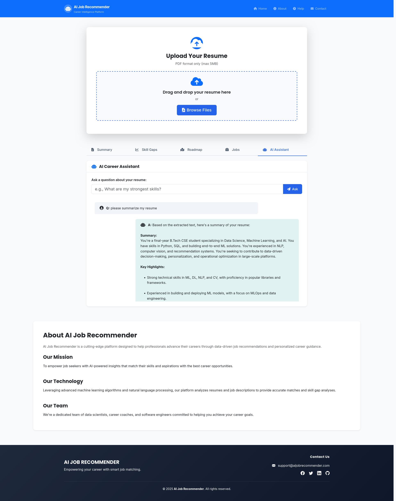

# AI Job Recommender 🤖

[](https://www.python.org/downloads/)
[](https://fastapi.tiangolo.com/)
[](LICENSE)
[](https://www.docker.com/)
[](https://cloud.google.com/)

An intelligent career advancement platform that leverages AI to analyze resumes, identify skill gaps, and provide personalized job recommendations with career roadmaps.



##   Features

### Core Functionality
- **Resume Analysis**: Upload PDF resumes for comprehensive AI-powered analysis
- **Skill Gap Identification**: Discover missing technical and soft skills in your profile
- **Career Roadmap**: Get personalized career progression recommendations
- **Job Matching**: Real-time job recommendations from LinkedIn via Apify
- **Interactive Q&A**: AI assistant for career-related questions about your resume

### Technology Stack
- **Backend**: FastAPI (Python 3.11+)
- **AI/ML**: Groq API with LLaMA 3 70B model
- **Job Data**: Apify LinkedIn Jobs API
- **PDF Processing**: PyMuPDF for text extraction
- **Frontend**: Bootstrap 5, JavaScript (ES6+)
- **Containerization**: Docker & Docker Compose
- **Cloud Platform**: Google Cloud Platform (GCP) ready

## 📋 Deployment Options

### Quick Start (Docker Hub)
The application is available as a pre-built Docker image:
```bash
docker pull yogesh1090/ai-powered-job-recommender:latest
```

Choose your deployment method:
- [🏠 Local Development](#local-development)
- [🐳 Docker Deployment](#docker-deployment)
- [☁️ Google Cloud Platform](#google-cloud-platform-deployment)

## 🛠️ Installation & Setup

### Prerequisites
- Python 3.11 or higher
- Docker & Docker Compose
- Google Cloud SDK (for GCP deployment)
- API Keys for:
  - [Groq API](https://groq.com/) (for AI analysis)
  - [Apify](https://apify.com/) (for job recommendations)

### Local Development

1. **Clone the repository**
```bash
git clone https://github.com/YogeshKumar-saini/AI-Powered-Job-Recommender-System
cd AI-Powered-Job-Recommender-System
```

2. **Setup virtual environment**
```bash
python -m venv venv
source venv/bin/activate  # On Windows: venv\Scripts\activate
```

3. **Install dependencies**
```bash
pip install -r requirements.txt
```

4. **Configure environment variables**
```bash
cp .env.example .env
# Edit .env with your API keys (no spaces around =)
```

5. **Run the application**
```bash
python3 main.py
```

### Docker Deployment

#### Option 1: Using Pre-built Image

1. **Create environment file**
```bash
# Create .env file with proper formatting (no spaces around =)
GROQ_API_KEY=your_groq_api_key_here
APIFY_API_TOKEN=your_apify_token_here
```

2. **Create docker-compose.yml**
```yaml
version: '3'
services:
  app:
    image: yogesh1090/ai-powered-job-recommender:latest
    env_file:
      - .env
    ports:
      - "8000:8000"  # For local access
```

3. **Deploy**
```bash
docker-compose up -d
```

#### Option 2: Build from Source

1. **Build Docker image**
```bash
docker build -t ai-job-recommender:latest .
```

2. **Run with Docker Compose**
```bash
# Update docker-compose.yml to use local image
# image: ai-job-recommender:latest
docker-compose up -d
```

### ⚠️ Docker Port Configuration Note

**For Local Development (Port 8000):**
```yaml
ports:
  - "8000:8000"  # host:container
```

**For Production/Web Deployment (Port 80):**
```yaml
ports:
  - "80:8000"   # Web traffic on port 80 -> App on port 8000
```

**Port Mapping Explanation:**
- First number = Host port (what you use in browser)
- Second number = Container port (what the app listens on inside Docker)
- Format: `"host_port:container_port"`

## ☁️ Google Cloud Platform Deployment

### Step 1: Prepare Docker Image

1. **Build and push to Docker Hub**
```bash
# Build image
docker build -t yogesh1090/ai-powered-job-recommender:latest .

# Login to Docker Hub
docker login

# Push to Docker Hub
docker push yogesh1090/ai-powered-job-recommender:latest
```

### Step 2: Create GCP VM Instance

1. **Go to Google Cloud Console**
   - Navigate to **Compute Engine** → **VM instances**
   - Click **Create instance**

2. **Configure VM**
   - Choose appropriate machine type (e2-medium recommended)
   - Select preferred region/zone
   - **Important**: Check ✅ **"Allow HTTP traffic"** and ✅ **"Allow HTTPS traffic"**
   - Click **Create**

### Step 3: Setup VM Environment

1. **SSH into VM**
```bash
gcloud compute ssh [VM_NAME] --zone [ZONE]
```

2. **Install Docker**
```bash
sudo apt-get update
sudo apt-get install -y docker.io docker-compose
sudo systemctl start docker
sudo systemctl enable docker
sudo usermod -aG docker $USER
```

3. **Logout and login again** to apply Docker permissions

### Step 4: Deploy Application

1. **Upload configuration files from local machine**
```bash
# From your local project directory
gcloud compute scp .env [VM_NAME]:~ --zone [ZONE]
gcloud compute scp docker-compose.yml [VM_NAME]:~ --zone [ZONE]
```

2. **SSH back into VM and verify files**
```bash
gcloud compute ssh [VM_NAME] --zone [ZONE]
ls -la ~/  # Should show .env and docker-compose.yml
```

3. **Create production docker-compose.yml**
```yaml
version: '3'
services:
  app:
    image: yogesh1090/ai-powered-job-recommender:latest
    env_file:
      - .env
    ports:
      - "80:8000"  # External port 80 -> Internal port 8000
    restart: unless-stopped
```

4. **Deploy application**
```bash
docker-compose up -d
```

5. **Verify deployment**
```bash
docker ps
curl http://localhost:80
```

### Step 5: Access Your Application

Your application will be accessible at:
```
http://[VM_EXTERNAL_IP]
```

Find your VM's external IP in the GCP Console under VM instances.

## 📋 API Documentation

### Interactive API Docs
Once running, visit:
- **Swagger UI**: `http://localhost:8000/docs`
- **ReDoc**: `http://localhost:8000/redoc`

### Key Endpoints

| Method | Endpoint | Description |
|--------|----------|-------------|
| `GET` | `/` | Main application interface |
| `POST` | `/upload-resume` | Upload and analyze PDF resume |
| `POST` | `/get-job-recommendations` | Fetch matching job opportunities |
| `POST` | `/ask-question` | Interactive Q&A about resume |
| `POST` | `/job-match-score` | Score resume against job description |
| `GET` | `/resume-score` | Get comprehensive resume evaluation |

## 🏗️ Project Structure

```
ai-job-recommender/
├── main.py                 # FastAPI application entry point
├── requirements.txt        # Python dependencies
├── docker-compose.yml      # Docker container configuration
├── Dockerfile             # Docker image definition
├── .env.example           # Environment variables template
├── src/
│   ├── __init__.py
│   ├── helper.py          # AI processing & PDF utilities
│   ├── job_api.py         # LinkedIn job fetching logic
│   └── requirements.txt   # Source-specific dependencies
├── static/
│   ├── style.css          # Custom styling
│   └── script.js          # Frontend JavaScript
├── templates/
│   └── index.html         # Main application template
└── README.md              # Project documentation
```

## 🔧 Configuration

### Environment Variables

Create a `.env` file with proper formatting (no spaces around `=`):

```env
# Required API Keys
GROQ_API_KEY=your_groq_api_key_here
APIFY_API_TOKEN=your_apify_token_here

# Optional Configuration
PYTHONUNBUFFERED=1
```

### Docker Configuration Examples

**Local Development:**
```yaml
version: "3.9"
services:
  app:
    build: .
    ports:
      - "8000:8000"
    env_file: .env
    volumes:
      - .:/app
    environment:
      - PYTHONUNBUFFERED=1
```

**Production Deployment:**
```yaml
version: '3'
services:
  app:
    image: yogesh1090/ai-powered-job-recommender:latest
    env_file:
      - .env
    ports:
      - "80:8000"
    restart: unless-stopped
```

## 🚀 Usage Guide

### 1. Upload Resume
- Navigate to the main interface
- Drag and drop your PDF resume or click to browse
- Wait for AI analysis to complete

### 2. Review Analysis
- **Summary**: Comprehensive resume overview
- **Skill Gaps**: Identified missing skills and certifications
- **Career Roadmap**: Personalized development recommendations

### 3. Get Job Recommendations
- Click "Find Jobs" to fetch matching opportunities
- Browse LinkedIn job listings tailored to your profile
- View job details and application links

### 4. Interactive Q&A
- Ask specific questions about your career path
- Get AI-powered insights and recommendations
- Example questions:
  - "What are my strongest technical skills?"
  - "How can I transition to a senior role?"
  - "What certifications should I pursue?"

## 🔍 Troubleshooting

### Common Issues and Solutions

**Port 8000 already in use**
```bash
# Kill the process using port 8000
sudo lsof -ti:8000 | xargs sudo kill -9
# Or use a different port
uvicorn main:app --host 0.0.0.0 --port 8001
```

**Docker Port Mapping Issues**
```bash
# If you see "port 80:80" but want to access on port 8000
# Update your docker-compose.yml:
ports:
  - "8000:8000"  # For local development
  - "80:8000"    # For web deployment

# Then restart the container
docker-compose down
docker-compose up -d
```

**GCP Connection Issues**
- **Cause**: Firewall not allowing HTTP traffic
- **Solution**: Enable "Allow HTTP traffic" in VM firewall settings

**Environment Variable Errors**
- **Cause**: Spaces around `=` in .env file
- **Solution**: Format as `KEY=value` with no spaces

**Authentication Scope Errors**
- **Cause**: Running gcloud commands inside VM SSH
- **Solution**: Run file upload commands from local machine

### Monitoring Commands

```bash
# View running containers
docker ps

# View container logs
docker logs [CONTAINER_NAME]

# Check application health
curl http://localhost:8000/docs  # Local
curl http://[VM_IP]/docs         # GCP

# Restart application
docker-compose restart

# Stop application
docker-compose down

# Update and redeploy
docker-compose pull
docker-compose up -d
```

## 🧪 Testing

### Manual Testing
```bash
# Test the API endpoints locally
curl -X GET http://localhost:8000/
curl -X POST http://localhost:8000/upload-resume -F "file=@sample_resume.pdf"

# Test on GCP deployment
curl -X GET http://[VM_EXTERNAL_IP]/
```

### Load Testing (Optional)
```bash
pip install locust
locust -f tests/load_test.py --host=http://localhost:8000
```

## 🤝 Contributing

We welcome contributions! Please see our [Contributing Guidelines](CONTRIBUTING.md) for details.

### Development Workflow
1. Fork the repository
2. Create a feature branch (`git checkout -b feature/amazing-feature`)
3. Commit your changes (`git commit -m 'Add amazing feature'`)
4. Push to the branch (`git push origin feature/amazing-feature`)
5. Open a Pull Request

## 📝 License

This project is licensed under the MIT License - see the [LICENSE](LICENSE) file for details.

## 🗺️ Roadmap

- [x] **v1.0**: Core functionality with AI analysis and job recommendations
- [ ] **v1.1**: User authentication and profile management
- [ ] **v1.2**: Multiple resume format support (Word, Text)
- [ ] **v1.3**: Advanced job filtering and preferences
- [ ] **v1.4**: Resume builder with AI suggestions
- [ ] **v2.0**: Mobile application (React Native)
- [ ] **v2.1**: Kubernetes deployment support

## 📊 Performance Metrics

- **Resume Processing**: ~3-5 seconds per PDF
- **Job Fetching**: ~5-10 seconds for 60 jobs
- **AI Analysis**: ~2-4 seconds per query
- **Concurrent Users**: Supports 50+ simultaneous users
- **Docker Image Size**: ~800MB
- **Memory Usage**: ~512MB average

## 🔗 Important URLs

- **Docker Hub Repository**: [yogesh1090/ai-powered-job-recommender](https://hub.docker.com/r/yogesh1090/ai-powered-job-recommender)
- **Live Demo**: `http://[YOUR_VM_IP]`
- **API Documentation**: `http://[YOUR_VM_IP]/docs`
- **Google Cloud Console**: https://console.cloud.google.com/

## 🆘 Support & Troubleshooting

### Getting Help
- 📧 Email: yksaini1090@gmail.com
- 🐛 Issues: [GitHub Issues](github.com/YogeshKumar-saini/AI-Powered-Job-Recommender-System)
- 💬 Discussions: [GitHub Discussions](github.com/YogeshKumar-saini/AI-Powered-Job-Recommender-System)
- 📖 Documentation: This README and inline code comments

## 🙏 Acknowledgments

- [FastAPI](https://fastapi.tiangolo.com/) for the excellent web framework
- [Groq](https://groq.com/) for lightning-fast AI inference
- [Apify](https://apify.com/) for reliable job data scraping
- [Bootstrap](https://getbootstrap.com/) for responsive UI components
- [Google Cloud Platform](https://cloud.google.com/) for scalable hosting

---

<div align="center">
  <p>Made with ❤️ by the Yogesh Kumar Saini</p>
  <p>⭐ Star this repo if it helped you!</p>
  
  **Deployment Status**: ✅ Successfully deployed and accessible via Docker Hub and GCP
</div>